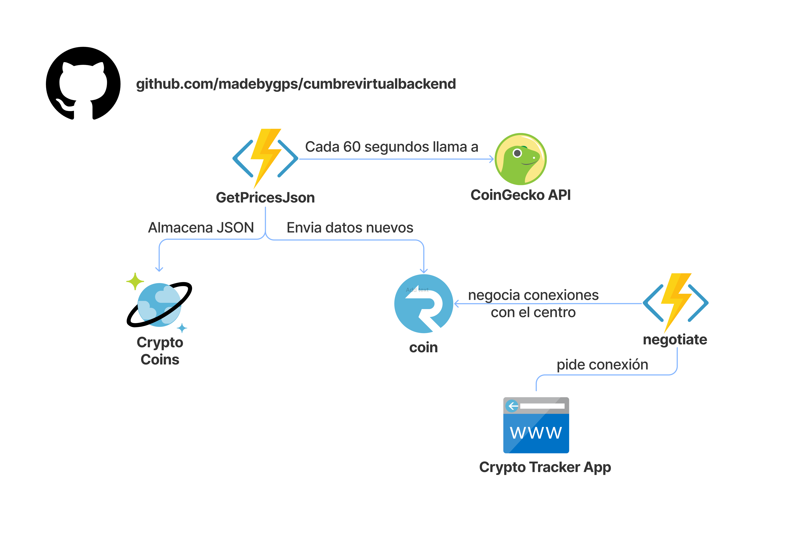

# Polling a pushed based

## Tech Stack

- **Azure Static Web Apps:** Servicio que compila e implementa automáticamente aplicaciones web de full stack desde un repositorio de código.
- **Azure Functions:** Servicio que permite ejecutar código serverless controlado por eventos.
- **Azure Cosmos DB:** Base de datos NoSQL totalmente administrada.
- **Azure SignalR Service:** Servicio que simplifica la incorporación de funcionalidades web en tiempo real a las aplicaciones a través de HTTP
- **.NET 6:** Plataforma de desarrollador open source, multiplataforma y gratuita para crear muchos tipos diferentes de aplicaciones.
- **Blazor WASM:** Framework que permite crear interfaces de usuario web interactivas utilizando C#.

## Requisitos de desarrollo local

- [Azure Functions](https://docs.microsoft.com/azure/azure-functions/functions-develop-vs-code?tabs=csharp#prerequisites)
- [.NET 6](https://dotnet.microsoft.com/download/dotnet/6.0)
- [Cuenta Cosmos DB](https://docs.microsoft.com/azure/cosmos-db/sql/create-cosmosdb-resources-portal#create-an-azure-cosmos-db-account)
- [Azure Static Web Apps Cli](https://github.com/Azure/static-web-apps-cli)
- [Recurso Azure SignalR Service](https://docs.microsoft.com/azure/azure-signalr/signalr-quickstart-dotnet-core#:~:text=To%20create%20an%20Azure%20SignalR,the%20results%2C%20and%20select%20Create.)
- [Blazor](https://dotnet.microsoft.com/learn/aspnet/blazor-tutorial/intro)
- [Client repo](https://github.com/madebygps/cumbrevirtual)

## Diagrama de arquitectura

